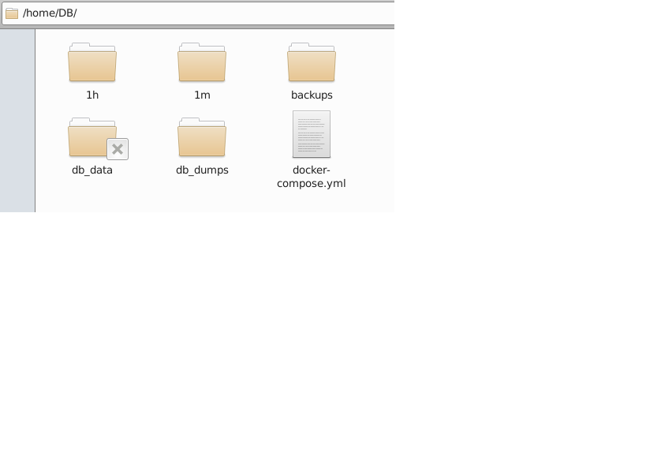

## Логическая структура:
- Создание БД на хосте
- Запуск загрузчиков котировок и расчета технических индикаторов, с формированием соотвествующих таблиц в БД
- Создание backup
### Схема расположения:

