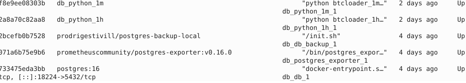
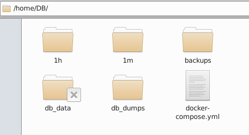

## Логическая структура развертывания:
- Создание БД на хосте
- Запуск загрузчиков котировок и расчета технических индикаторов, с формированием соотвествующих таблиц в БД
- Создание backup

Таким образом создаются 4 контейнера, 2 контейнера с загрузчиками, один с базозй данных, и один контенер бэкапа.

## Схема расположения:

## Описание
### 1m
Папка с загрузчиком  минутного таймфрейма
- Dockerfile для загрузчика
- btcloader_1m_futures.py загрузчик
- requirements.txt зависимости
- schemas.py описание схемы таблиц БД
### 1h 
Папка с загрузчиком часового таймфрейма
- Dockerfile для загрузчика
- btcloader_1h_futures.py загрузчик
- requirements.txt зависимости
- schemas.py описание схемы таблиц БД 
### db_dump  
Dump базы данных для начального развертывания
190мб здесь нет
### db_data  
volume базы данных  
### backups  
volume бэкапы БД
*.sql.gz тоже нет

## Развертывание:
- ufw открыть порт 18224 для внешнего доступа к БД
- docker-compose.yml  docker-compose up --build

# createdataframe
Папка с py модулем содержащим функции(котировки, индикаторы из дополнительных источников, 
предсказания вспомогательных моделей итп) для создания первичного датафрейма и функцией создания первичного датафрейма.

